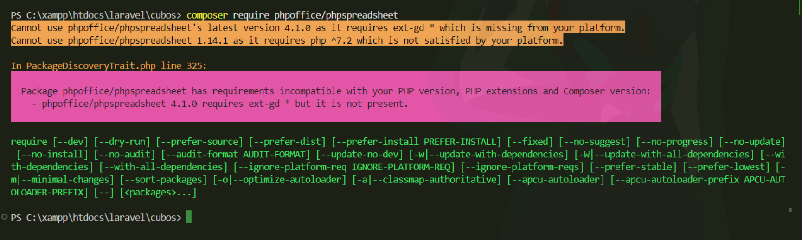

# Pasos para correr el proyecto 

## 1. Instalar PhpSpreadsheet
```bash

composer require phpoffice/phpspreadsheet

```

Si da este error 
Hacer lo siguiente:
1. Habilita ext-gd en tu archivo php.ini
Abre tu archivo php.ini desde: C:\xampp\php\php.ini
2. Buscar esta línea y descoméntarla (quítale el ; al inicio): 
    ```bash
    ;extension=gd
    ```

## 2. Correr la API

entrar a la carpeta de la API y correrla

```bash
cd Api_cubo

python -m uvicorn filtrado_post:app --reload --host 0.0.0.0 --port 8070

```

## Correr el proyecto de Laravel 
```bash
php artisan migrate 

php artisan serve 
```
Abrilo en el navegador:

http://127.0.0.1:8000/consultar-clues

