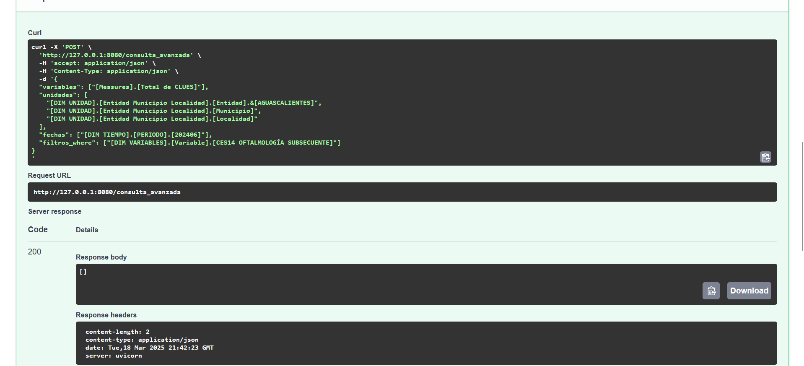
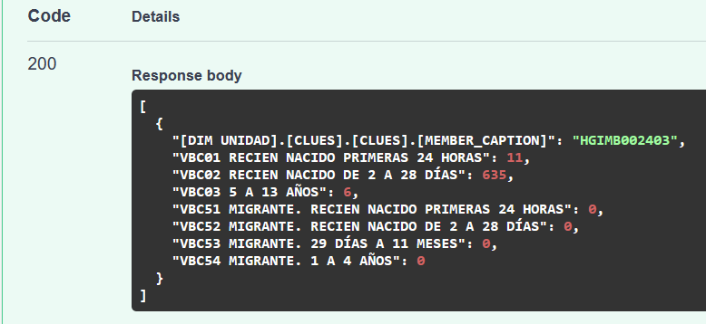

# Consumo de Cubos Dinámicos

Este proyecto tiene como objetivo conectarse y consumir datos desde cubos OLAP de SQL Server Analysis Services (SSAS) a través de una API desarrollada en Python.

### Entorno de trabajo para ejecutar la API

- Sistema operativo: Windows  
- Python: 3.12  
- DB: SQL Server  
- Driver: MSOLAP

Es necesario instalar las [Bibliotecas cliente de Analysis Services](https://learn-microsoft-com.translate.goog/en-us/analysis-services/client-libraries?view=asallproducts-allversions&_x_tr_sl=en&_x_tr_tl=es&_x_tr_hl=es&_x_tr_pto=tc), según la versión que corresponda a tu entorno. A continuación se muestra una imagen referencial:


Una vez instaladas las bibliotecas, se deben instalar las siguientes dependencias ejecutando los siguientes comandos en la terminal:

```bash
pip install requirements.txt      # Instalar librerias.
```


Para ejecutar la API:

```bash
python -m uvicorn api:app --host 0.0.0.0 --port 8080
python -m uvicorn api_cubos:app --host 0.0.0.0 --port 8080
```
### Entorno de trabajo para consumir la API
 - Sistema operativo: Multiplataforma
 - Python: 3.12

Para consumir la API 
```bash
python consumo_api.py
```

Solo que se tiene que poner que enpoint se quiere consumir y la IP de la API que se esta ejecutando como servidor

# JSON para consultas de tiempo, variable y unidad 

## Cuantas unidades hay registradas  en ese estado

```bash
{
  "variables": ["[Measures].[Total de CLUES]"],
  "unidades": ["[DIM UNIDAD].[Entidad].[CIUDAD DE MEXICO]"],
  "fechas": ["[DIM TIEMPO].[PERIODO].[202406]"],
  "filtros_where": ["[DIM VARIABLES].[Variable].[CES14 OFTALMOLOGÍA SUBSECUENTE]"]
}


{
  "variables": ["[Measures].[Total de CLUES]"],
  "unidades": ["[DIM UNIDAD].[Entidad].[HIDALGO]"],
  "fechas": ["[DIM TIEMPO].[PERIODO].[202406]"],
  "filtros_where": ["[DIM VARIABLES].[Variable].[CES14 OFTALMOLOGÍA SUBSECUENTE]"]
}

```

## Muestra todos los estados que tiene dicha especialidad
```bash

{
  "variables": ["[Measures].[Total de CLUES]"],
  "unidades": ["[DIM UNIDAD].[Entidad].[Entidad]"],
  "fechas": ["[DIM TIEMPO].[PERIODO].[202406]"],
  "filtros_where": [
    "[DIM VARIABLES].[Variable].[CES14 OFTALMOLOGÍA SUBSECUENTE]"
  ]
}

```

### Debería mostrar la información de  unidad (municipio, entidad, localidad), pero nos manda vacio 



```bash

{
  "variables": ["[Measures].[Total de CLUES]"],
  "unidades": [
    "[DIM UNIDAD].[Entidad Municipio Localidad].[Entidad].&[AGUASCALIENTES]",
    "[DIM UNIDAD].[Entidad Municipio Localidad].[Municipio]",
    "[DIM UNIDAD].[Entidad Municipio Localidad].[Localidad]"
  ],
  "fechas": ["[DIM TIEMPO].[PERIODO].[202406]"],
  "filtros_where": ["[DIM VARIABLES].[Variable].[CES14 OFTALMOLOGÍA SUBSECUENTE]"]
}

```

### Esta consulta devolverá el listado completo de miembros (especialidades) disponibles en la dimensión [DIM VARIABLES].[Variable].

```bash
{
  "variables": ["[Measures].[Total de CLUES]"],
  "unidades": ["[DIM VARIABLES].[Variable].MEMBERS"],
  "fechas": ["[DIM TIEMPO].[PERIODO].[202406]"]
}

```
### consultando los miembros de la dimensión [DIM VARIABLES].[Variable]

```bash

{
  "variables": ["[Measures].[Total de CLUES]"],
  "unidades": ["[DIM VARIABLES].[Variable].MEMBERS"],
  "fechas": ["[DIM TIEMPO].[PERIODO].[202406]"],
  "filtros_where": [
    "[DIM UNIDAD].[Entidad].[HIDALGO]"
  ]
}


```
### Muestra que Municipios hay en un estado
```bash 

{
  "variables": ["[Measures].[Total de CLUES]"],
  "unidades": ["[DIM UNIDAD].[Municipio].[Municipio].MEMBERS"],
  "fechas": ["[DIM TIEMPO].[PERIODO].[202406]"],
  "filtros_where": [
    "[DIM UNIDAD].[Entidad].[HIDALGO]"
  ]
}


```

### Distribución del Total de Unidades de Salud (CLUES) por Entidad Federativa

```bash

{
  "variables": ["[Measures].[Total de CLUES]"],
  "unidades": [
    "[DIM UNIDAD].[Entidad].[Entidad]",
    "[DIM UNIDAD].[Tipología Unidad].[Tipología Unidad]"
  ],
  "fechas": ["[DIM TIEMPO].[PERIODO].[202406]"]
}


```


### ejemplo de consulta de   PACHUCA HGIMB002403 con las siguientes variables
VBC01
VBC02
VBC03
VBC51
VBC52
VBC53
VBC54
VBC55

```bash

{
  "variables_clave": ["VBC01", "VBC02", "VBC03", "VBC51", "VBC52", "VBC53", "VBC54"],
  "unidades": ["[DIM UNIDAD].[CLUES].[HGIMB002403]"]
}


```

Resultado:



### Para  que los metodos de la api puedan ser consumidos desde el archivo app.py primero se debe de correr la API (filtrado_post.py) y despues correr el archivo app.py, el cual consume directamente las varibales


```bash
#Comando para correr API
python -m uvicorn filtrado_post:app --reload --host 0.0.0.0 --port 8080

#Comando para correr app.py

python app.py

```


